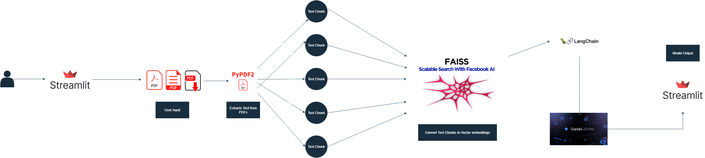

# DocuChat AI – Interactive PDF Q&A Assistant

**Description**  
DocuChat AI is a Streamlit web application that enables users to upload PDF documents and interactively ask questions about their content using Google Gemini's large language model (LLM) with semantic search powered by FAISS vector embeddings and Langchain.

---

## Features

- Upload multiple PDFs and extract text automatically
- Chunk text for efficient processing and embedding generation
- Create and save a FAISS vector store for semantic search
- Ask natural language questions about your PDFs and get detailed answers
- Built with Google Generative AI's Gemini models for embeddings and chat

---

---

## Tech Stack

- **Python**  
- **Streamlit** for front-end UI  
- **LangChain** for LLM question-answering chains  
- **Google Generative AI (Gemini)** API for embeddings and chat LLM  
- **FAISS** for semantic vector similarity search  
- **PyPDF2** for PDF text extraction  

---

---

## Architecture Diagram

---
